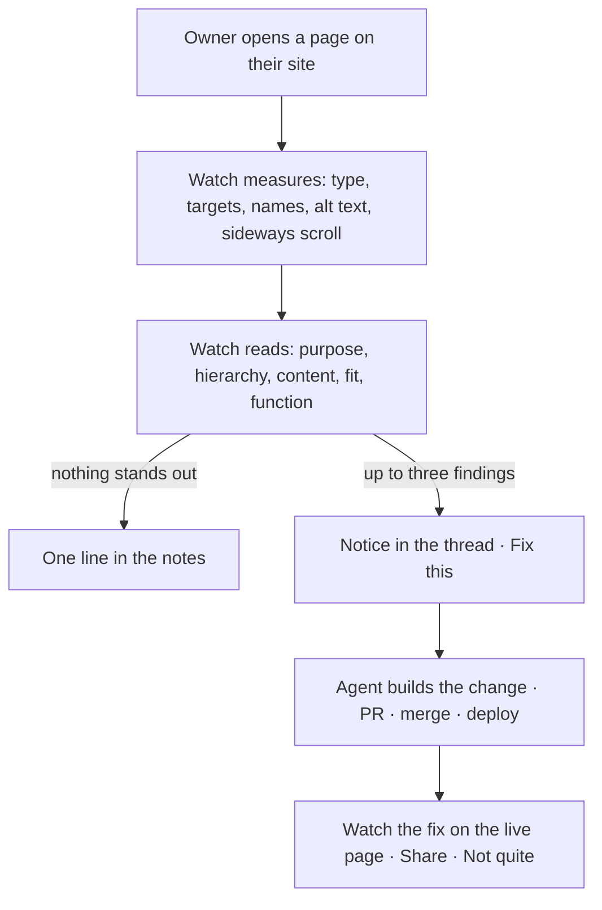

## The thing it kept saying

For a week the owner of several sites opened them on a phone with Loki's widget switched to Watch, and Loki noticed the same thing each time: "4 pieces of text are under 12px." On one page that was true and useful. On the next it was true and beside the point, because the page opened with a headline that said "Welcome" and nothing about what the site did, offered two buttons that led to the same place, and repeated its numbers in two blocks a screen apart. Loki saw none of that. It saw the font size.

The owner's note was short: *why didn't it catch what I am right now pointing out?*

## Why a ruler cannot see it

Watch worked by measuring. It walked the page's elements and counted the ones that broke a rule a visitor could feel: text too small to read, a tap target smaller than a fingertip, a button a screen reader would announce as "button", a form field with only a placeholder for a name, an image with no alt text or one that failed to load, a page wider than the screen so it scrolls sideways. Every one of those is a real defect, and every one of them is a number.

Hierarchy is not a number. Neither is a headline that says nothing, a paragraph that says it twice, or two controls that do the same thing. Those are judgements a person makes in the first two seconds on a page, and they are the things that decide whether a visitor stays. A tool that only measures will report the small text on a page that has no reason to exist, and it will do it with perfect confidence.

| | The ruler | The reader |
|---|---|---|
| Looks at | Elements and their computed styles | The page's outline: wording, structure, links, forms |
| Finds | Small type, tiny targets, missing names and labels, missing alt text, broken images, sideways scroll | Purpose, hierarchy, content, fit, function |
| Says | "4 pieces of text under 12px" | "The headline 'Welcome' does not say what this is for" |
| Costs | Nothing | One model call per page, per visit |
| Silent when | Every rule passes | Nothing stands out |

## What it does now

Watch still measures. From this change it also reads. Once per visit to a page, after the measurements, Loki hands the page's outline to a model with one instruction: read this as a first-time visitor on a phone who has never seen it, and judge only what that visitor would feel. Purpose first — within the first screen, is it clear what this page is for and what to do here? Then hierarchy, content, fit, function. At most three findings, each one line, each quoting the actual wording. No praise, no preamble.

If nothing stands out, the answer is exactly that, and it goes into the notes rather than onto the screen. Silence when fine is the rule the rest of Watch already lived by: a read that lists five polish items with a button each would be the noise the review was built to avoid.

When something does stand out, it arrives the same way a measurement does — a notice in the thread, with the same **Fix this**. The owner taps it, an agent makes the change, the pull request merges, the site deploys, and the walkthrough shows the before and after on the live page. The reader did not get a new path through the product. It got the old one.



```deep Under the hood: the rubric
The read is a second rubric beside the review one in `src/lib/widget-advise/advisor.ts`, chosen when the request carries `read: true` and the owner pass verifies. Its five lenses, in the order they are judged:

- **Purpose** — within the first screen, is it clear what this page is for and what to do here? Quote the headline if it does not say.
- **Hierarchy** — does the most important thing read first, or do several things compete at the same weight? Name the two that compete.
- **Content** — text that says nothing, says it twice, uses words a visitor would not, or runs long where a line would do. Quote it.
- **Fit** — parts that do not belong together: a control repeated, two labels for one thing, an element that belongs on another page, states that contradict each other (a green badge under a heading that says it needs you). Quote both.
- **Function** — a control whose outcome a visitor could not predict from its label.

Only what the outline shows; never invent. At most three findings, each one line quoting the wording. If nothing stands out, answer exactly "nothing stands out" and write `CHANGES: none`. Plain text, under 120 words. The model sees a text outline of the page — structure, wording, links, forms, some computed styles — not a screenshot, and the prompt says so, so it cannot claim anything about looks it cannot see.
```

```deep Under the hood: once per visit
The widget keeps a set of remarks it has already made this visit, keyed by a signature, in `sessionStorage`. A measurement's signature is the rule and the path; the read's is `<path>|read`. A reload does not repeat it, a second page gets its own, and the set clears with the session. The browser test (`scripts/test/widget-watch-browser.ts`, real Chromium) pins exactly that: across two page loads and a reload, one read per path, with no session attached, and the on-demand review still asked once.

The read runs only on the owner pass — a visitor's browser never pays for it — and only while Watch is on. The route's limits did not move: 12 requests per IP and 200 per token per window, and the read is one request.
```

## What it still cannot see

It reads an outline, not a picture. A page can be structurally sound and visually wrong, and the reader will not know. The measurements cover some of that gap; a screenshot would cover more, and the review that files findings through the inbox already takes one. The read does not, because it runs on every page the owner opens and a screenshot per page is a different cost.

It reads a page, not a journey. Two pages that each make sense and together make no sense — a form on one, its confirmation nowhere — are invisible to a per-page read. The widget already keeps the trail of taps across pages and reviews it when asked, under "Review my last few minutes". Making that unasked too is the next step, once the per-page read has earned the trust to be believed without being checked.

And it is only as good as its rubric. The browser test proves the mechanics: once per visit, owner only, silence when fine. It proves nothing about the judgement. That is proven the slow way, by whether the owner taps **Fix this** or ignores the notice, and the second of those is the measurement that matters.

A page that says nothing first is the first thing a visitor notices and the last thing a ruler can.
