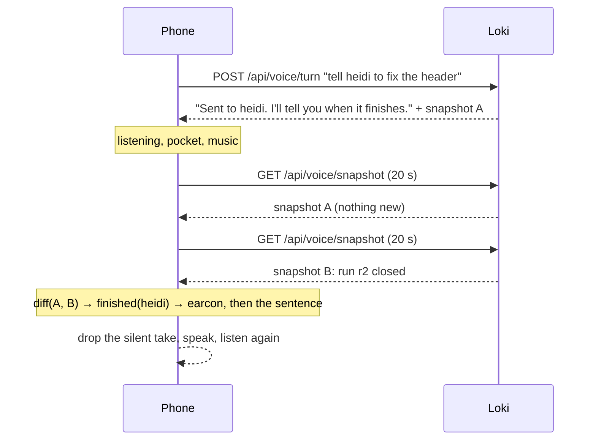

## The computer broke, the fleet did not

The operator's computer broke this week. The fleet did not stop: twelve projects kept building on the box, the feedback widget kept filing reports, the approval queue kept filling. What stopped was the way of watching it. Everything in Loki assumed a screen, and the only screen left was a phone, which also assumes you are looking at it.

The brief, dictated into that phone, was short: *I don't want to look. I want to hear it in the headphones, say what I want into the microphone, and still have total control of what is going on with my fleet.*

That is no-screen mode. It lives at `/voice`, it shipped today, and this is what it is like.

## What it is like

Headphones in. Press Start, once. A quiet bed of slow chords begins, and a voice says:

> One agent is working: heidi for 12 minutes. One run is waiting for a builder: solon. One thing is waiting on you. Say "what's waiting" to hear it. One run failed: orangecat. Say "what failed" for the errors.

Then the phone goes in your pocket and you go for the walk.

Twenty minutes later, two rising notes, and the voice: *Done on heidi: the header fits at 320 pixels.* You keep walking. A knock, two equal notes: *New approval: reply to the visitor who reported the broken header. Say approve or reject.* You say "approve." *Approved.* You say "tell orangecat to run the tests and fix what fails." *Sent to orangecat. I'll tell you when it finishes.*

Nothing else happens for ten minutes, and that silence is fine, because the music is still there, so you know the line is still open.

```stats
1 tap | then the phone goes in your pocket
13 | things you can say; everything else is a question for Loki
20 s | between a run finishing and you hearing about it
0 | new ways to approve, dispatch or pause — it reuses the screen's
```

## Why it is bearable to listen to

A voice is a slow channel. About 150 words a minute, no skimming, no scrolling back. An AI voice that talks too much is the fastest way to make someone take the headphones out, and the first version of this did exactly that: every twenty seconds, the same sentence shape, in the phone's robot voice, with silence in between that was indistinguishable from a dead phone. Four things fixed it.

**A voice you can live with.** Signed in, Loki reads with a studio voice, one of six, in pieces short enough to sound like speech rather than a text box being read out. If the box has no voice configured, or the signal drops, the phone's own voice takes over mid-sentence. The words are the same; only the sound is worse.

**Music the phone makes itself.** A bed of slow chords, composed on the phone while you listen. No file, no licence, no stream, nothing downloaded; it costs nothing to leave on for an hour. It drops under the voice and comes back after. Its real job is to make silence sound like a line that is open, and when the line actually drops you hear two low falling notes and *I lost the connection. I'll keep trying.*

**A tone before the news.** Rising notes for a run that finished. Falling notes for one that failed. Two equal notes, a knock, for something that needs you. Each under half a second, so the ear knows what kind of news is coming before the first word, and can decide how much attention it deserves.

**Fewer, better sentences.** Three runs finishing in one minute are one sentence with three names, not three sentences with the same verb. The same news never comes in the same words twice in a row. What needs you comes first; what merely happened comes after, or, if you flip one switch, is held and read as a single sentence every five minutes. "Details" reads what each run actually did, only when you ask.

And you can talk over it. Say anything while Loki is speaking and it stops and listens.

## What you can say

| You say | What happens |
| --- | --- |
| Status / what's going on | The briefing |
| What's waiting on me | The approval queue, numbered |
| Approve the first one / approve all | The same decision the Approvals page makes |
| Reject number two | The draft is rejected |
| Tell heidi to fix the header | A run starts on heidi; you hear when it ends |
| What failed | Today's errored runs, with the error |
| Pause everything / pause heidi | Autopilot off, fleet or project |
| Resume everything | Autopilot back on |
| Details | What the last announced runs actually did |
| Say that again · Quiet · End | Handled on the phone |
| Anything else | Loki answers as in chat, read aloud |

Every action is the one the screen makes. No-screen mode adds a mouth and an ear to seams that already existed; it adds no second way to approve, dispatch or pause, so the page and the headphones cannot disagree.

```deep Under the hood: the grammar, and why it is not a model
The tempting build is to hand every sentence to a model and let it decide whether "approve" meant approve. On a screen that is fine: the action lands in a confirmation dialog. With the screen off there is no dialog. So `lib/voice/commands.ts` is a grammar: regular expressions over a normalised sentence, with project names matched through the same slug-to-speech matcher the composer uses (`lib/project-mention.ts`), so "orange cat" finds `orangecat` and "going" does not find `go`.

Three consequences, all deliberate:

- A bare **"yes"** is not an approval. It could be answering anything. "Yes, approve the second one" is.
- A bare **"stop"** means *be quiet*, never *stop the fleet*. "Stop everything" does.
- A sentence that names no registered project is **not a dispatch**, however imperative it sounds. It becomes a question for `askLoki`, and Loki says so.

The vocabulary is one list, `config/no-screen.ts`, read by the parser, by the spoken "what can I say" answer, and by the public page. `scripts/test/voice-commands.ts` feeds every example phrase on that page through the parser and asserts the kind. A phrase the page promises and the parser does not understand is a lie you would discover with your eyes closed, so it cannot ship.

| You say | Seam |
| --- | --- |
| Status, what's waiting, what failed | loadFleetSnapshot, then composeBriefing, composeWaiting or composeFailures (pure, 12 checks) |
| Approve, reject | decideAction, the Approvals page's own function |
| Tell X to … | injectPrompt, the composer's own send, with notifyOnClose |
| Pause, resume | pauseFleetProjects and resumeFleetProjects (the second is new: the same walk, override cleared) |
| Anything else | askLoki, the chat, with the last eight turns as history |
```

## Told, not asked

A chat waits for you. A fleet does not. The thing the operator actually wanted was not to ask *status* every two minutes; it was to be told.

So between turns the phone asks Loki every twenty seconds what the fleet looks like, compares it with the last answer, and reads the difference into the headphones, unasked. A run that ended, a run that failed, a new approval, the builder dropping offline or coming back, a project starting work.


In sequence, with the twenty-second poll doing the work between turns:



```deep Under the hood: the loop, the diff and the announcements
`diffSnapshots` (in `lib/voice/briefing.ts`) returns typed changes — `finished`, `failed`, `approval`, `builder-offline`, `builder-online`, `alert`, `started` — bounded to five per poll so a phone reconnecting after an hour does not read out the afternoon. The sentences are `lib/voice/announce.ts`'s job: it sorts by urgency, coalesces by kind, picks one of two or three phrasings by a counter the phone advances, and names the earcon for each. In "important" mode `splitByMode` holds `finished` and `started` for a digest `phraseHeld` reads every five minutes. `scripts/test/voice-announce.ts` pins all of it, including that variants differ in words and never in facts.

Speaking unasked needed one change to the voice hook that the Loki page's Talk button also uses: a `say(text, cue)` that takes the turn at once while the microphone is listening (the take in progress is dropped — nobody was mid-sentence, or the level would have ended it), queues behind the answer while Loki is thinking or speaking, and plays its cue, the earcon, right before the words. If the person cuts in, the queue waits one listen so that listen is theirs. And idle no longer pauses: twenty seconds of silence re-arms the microphone, because *paused* is a dead end whose only exit is on a screen.
```

```deep Under the hood: the sound
Everything that is not words goes through one `AudioContext` (`hooks/use-soundscape.ts`), and one `MediaStream` out of it is what an `<audio>` element plays — so the phone treats the whole thing as a track: lock-screen title, the headphone button as play/pause, and playback that continues with the screen off wherever the platform lets a track do that.

**Earcons** are MIDI notes with start and length (`lib/voice/soundscape.ts`): `finished` is C5–E5–G5 rising over 0.48 s, `failed` is G4 to E♭4 falling, `attention` is E5 twice, `heard` is one C6 blip of 80 ms when a take is sent. A test pins that none lasts longer than 0.6 s and that good news rises while bad news falls.

**The music** is six chords in D — D, Bm, Gmaj7, A, Dsus2, Cmaj7 — each held 18 s, every note two oscillators (a sine and a triangle) detuned five cents apart so it breathes, through a low-pass filter whose cutoff drifts ±250 Hz around 900 Hz at 0.04 Hz, into a 550 ms feedback delay. Nothing above MIDI 66 (F♯4), so it stays below the 1–4 kHz band where speech lives. Level 0.09 at rest, 0.025 under the voice, ramped over 0.3 s down and 1.5 s back up.

**The voice**, signed in, is Groq's Orpheus endpoint (`canopylabs/orpheus-v1-english`, six voices, $22 per million characters, roughly a cent for an hour of briefings). The vendor asks for about 200 characters a request, so `splitForSpeech` cuts a briefing at sentence ends, then clause ends, then words; the next piece is fetched while the current one plays so the cut is not a pause. The pieces are decoded with `decodeAudioData` and played through the speech bus, which is what lets the music duck under them. Any failure hands the rest of the text to `SpeechSynthesis` and stops asking the server for two minutes, so a box without a key costs one hiccup, not a silence.

**Talk-over** keeps the analyser running while Loki speaks: a burst above 2.5× the room's speech bar for 350 ms is a person, the voice stops, and the microphone is theirs. The phone's echo cancellation keeps Loki's own voice from counting; with headphones there is nothing to cancel. The first third of a second is spent deciding, so "Loki, …" as a lead-in costs nothing and loses nothing.
```

## What it has not passed

**A locked iPhone in a pocket for an hour.** The loop has been run in a desktop browser with a synthetic microphone, and the four pure halves (grammar, briefing, announcements, sound) are pinned by 60 checks in `scripts/test/`. The music and the voice now travel as one media track, which is the mechanism platforms use to keep audio alive with the screen off; whether the microphone stays open alongside it on a locked iPhone is the test that matters, and it has not been run. The page says so until it passes. If the answer is no, the fix is the native shell on the remote-control channel already on the roadmap, not a cleverer web page.

**Your words leave the phone once; Loki's leave it once.** What you say goes to the transcriber and is discarded there. With the studio voice on, what Loki says goes out once to be spoken; with the phone's voice, nothing of Loki's leaves. The text stays in Loki.

**The PIN holds.** Approvals behind the private-zone PIN are not read aloud until you unlock them on screen, and the briefing says *locked* rather than pretending there are none. A mode built to need no screen still needs it once for the thing a screen was guarding.

## What it changes

The dashboard is still there. But the question Control was built around — *is anything waiting on me?* — now has an answer that arrives without being looked for, in a voice you can keep in your ear while you do something else. The fleet was already running without supervision. Now it can be supervised without a screen.

A dashboard asks you to look. A fleet you can hear asks nothing until something needs you.
