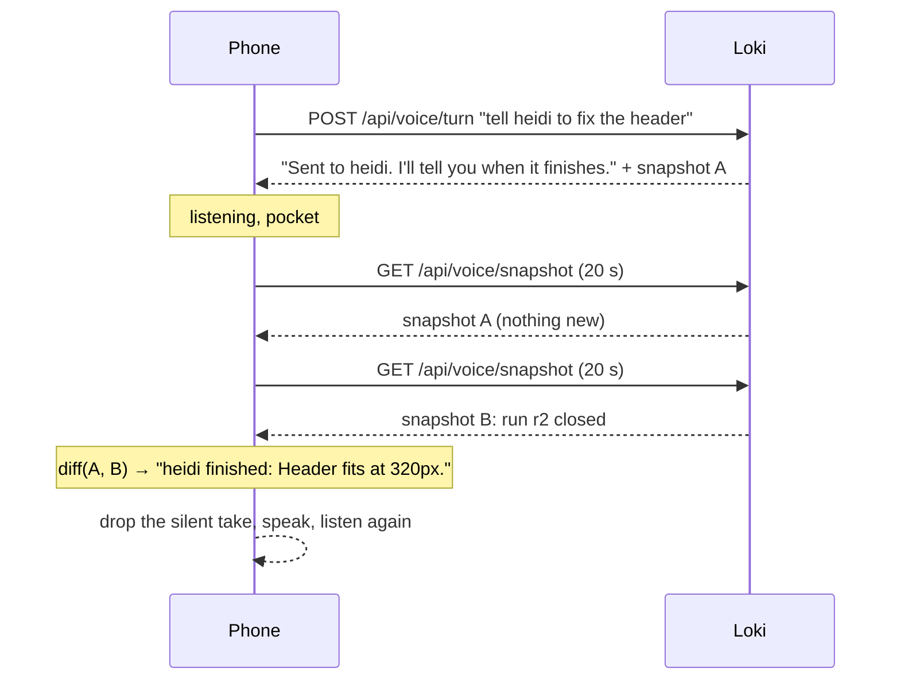

## The operator's computer broke

The operator's computer broke this week. The fleet did not stop: twelve projects kept building on the box, the feedback widget kept filing reports, the approval queue kept filling. What stopped was the way of watching it. Everything in Loki assumed a screen, and the only screen left was a phone — which also assumes you are looking at it.

That was the brief, dictated: *I don't want to look. I want to hear it in the headphones, say what I want into the microphone, and still have total control of what is going on with my fleet.*

Loki already had half of it. The Loki page has had a Talk button since September: listen until you pause, transcribe, answer, read the answer aloud, listen again. It is a good voice chat. It is not control. It knows nothing about the fleet unless you ask, says nothing until you ask, and twenty seconds of silence puts it to sleep behind a tap on a screen you are not looking at.

No-screen mode is that loop, made the whole surface. It shipped today at `/voice`.

## What a fleet sounds like

Press Start once. The microphone opens and the first thing you hear is the briefing:

> One agent is working: heidi for 12 minutes. One run is waiting for a builder: solon. One thing is waiting on you. Say "what's waiting" to hear it. One run failed: orangecat. Say "what failed" for the errors.

Every sentence of that is composed from one snapshot of the tables the Control page reads — open agent turns, runs by state, alerts, the approval queue, the builder's heartbeat — by a pure function with a test around it. It leads with what needs the person. It never lists idle projects. When there is nothing, it says *All quiet. Nothing is running and nothing is waiting on you*, because with the eyes shut silence is indistinguishable from a dead microphone.

Then you talk. Twelve things are commands; everything else is a question for Loki, answered the way the Loki page answers it and read aloud.

| You say | What happens, through which seam |
| --- | --- |
| Status / what's going on | The briefing. One snapshot, composed into sentences |
| What's waiting on me | The approval queue, numbered. Same snapshot |
| Approve the first one / approve all | The draft is approved and executes. The Approvals page's own decision (decideAction) |
| Reject number two | The draft is rejected. Same decision |
| Tell heidi to fix the header | A run starts on heidi; you hear when it ends. The composer's own send (injectPrompt) |
| What failed | Today's errored runs, with the error. Same snapshot |
| Pause everything / pause heidi | Autopilot off, fleet or project. Control's own button |
| Resume everything | Autopilot back on. New today, as the mirror of pause |
| Say that again · Quiet · End | Handled on the phone, no round trip |
| Anything else | A chat answer, read aloud. The Loki page's own ask |

The right-hand column is the design. No-screen mode adds a mouth and an ear to seams that already existed. It adds no second way to approve, dispatch or pause, so there is nothing new to keep consistent with the screen: the page and the headphones cannot disagree, because they call the same function.

## The grammar is explicit on purpose

The tempting build is to hand every sentence to a model and let it decide whether "approve" meant approve. On a screen that is fine; the action lands in a confirmation dialog. With the screen off there is no dialog. So the parser is a grammar — regular expressions over a normalised sentence, project names matched through the same slug-to-speech matcher the composer uses, so "orange cat" finds `orangecat` and "going" does not find `go`.

Three consequences, all deliberate:

- A bare **"yes"** is not an approval. It could be answering anything. "Yes, approve the second one" is.
- A bare **"stop"** means *be quiet*, never *stop the fleet*. "Stop everything" does.
- A sentence that names no registered project is **not a dispatch**, however imperative it sounds. It becomes a question, and Loki says so.

The vocabulary itself is one list, `config/no-screen.ts`, read by the parser, by the spoken "what can I say" answer, and by the marketing page. The test feeds every example phrase on that page into the parser and asserts the kind. A phrase the page promises and the parser does not understand is a lie you would discover with your eyes closed, so it cannot ship.

## The part that is not a chat: announcements

A chat waits for you. A fleet does not. The thing the operator actually wanted was not to ask *status* every two minutes; it was to be told.

So between turns the phone polls `/api/voice/snapshot` every twenty seconds and diffs it against the last one. A run that ended, a run that failed, a new approval, the builder dropping offline or coming back, a project starting work: each becomes one sentence, read into the headphones unasked.

The diff is pure and bounded. It announces at most five things per poll, so a phone that reconnects after an hour does not read out the whole afternoon. It does not announce a project going idle: the run's own ending already said that.

Speaking unasked needed one change to the voice hook, and it is the only change to the Loki page's Talk button: a `say()` that takes the turn at once while the microphone is listening (the take in progress is dropped — nobody was mid-sentence, or the level would have ended it) and queues behind the answer while Loki is thinking or speaking. And idle no longer pauses. Twenty seconds of silence re-arms the microphone, because *paused* is a dead end whose only exit is on a screen.

## The headphone button is the only button

A phone hands its play/pause and track keys to whichever page is playing audio, and to nothing otherwise. A page that only listens and speaks gets none of them. So no-screen mode plays a loop of silence — one second of 8-bit nothing, built in memory, 8,044 bytes, no asset — and holds the media session. Play/pause becomes the tap on the circle: send what I just said, or cut Loki off and talk. Next track asks for the briefing. The lock screen shows the phase as the track title, for the one glance the mode allows itself.

That is the entire physical interface: one button you already have on the cable.

## What it has not passed yet

Three limits, stated here because the page states them too.

**It is a web page.** The microphone, the voice and the button are the browser's. The loop has been run in a desktop browser with a synthetic microphone, and the two pure halves — the grammar and the briefing — are pinned by 40 checks in `scripts/test/`. A locked iPhone in a pocket, for an hour, is the test that matters and the one that has not been run. The marketing page carries that sentence until it passes. If the browser suspends the page when the screen locks, the fix is a native shell on the remote-control channel already on the roadmap, not a cleverer web page.

**Your words leave the phone once.** What you say goes to the transcriber and is discarded there; the text stays in Loki. Loki's answers are spoken by the phone's own voice. A better voice would mean the answers leaving too, and that trade is not taken yet.

**The PIN holds.** Approvals behind the private-zone PIN are not read aloud until you unlock them on screen, and the briefing says *locked* rather than pretending there are none. A mode built to need no screen still needs it once for the thing a screen was guarding.

## What it changes

The dashboard is still there. But the question Control was built around — *is anything waiting on me?* — now has an answer that arrives without being looked for. The agent fleet was already running without supervision. Now it can be supervised without a screen, which is the first time the operator has been free of the one object that was keeping them in the loop.

A dashboard asks you to look. A fleet you can hear asks nothing until something needs you.
