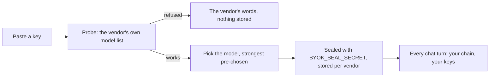

# Models and money

**Date**: 2026-10-09
**Status**: shipped (this document describes what runs; open decisions at the end)

Loki has no merchant account and cannot take a card. It also runs its chat on
a shared pool of free models with a daily budget. Both facts shape how a
person gets *more* out of Loki, and this is the one place the whole shape is
written down — as a system, a product, a business and a screen.

## The three ways Loki runs

| | Who pays | What it buys | Where it is set up |
|---|---|---|---|
| **Free pool** | Nobody | The shared chain of open models, with a daily budget per account | Nothing to do |
| **Your own keys** | You, to your model vendor | Any model your key can reach; the daily budget no longer applies to your chats | Settings → AI |
| **A Loki pass** | You, in Bitcoin, on OrangeCat | Room: the project limit lifts for a month at a time | Settings → Billing, or /pricing |

These are independent. A person on Free with an OpenRouter key runs on the
strongest model they can afford with no pass. A person on a Pro pass with no
key runs on the free pool with more projects. The two cards on the Billing
tab say exactly this, because the question "how do I get a better model" and
the question "how do I get more room" have different answers and a single
"Upgrade" button would send both to the wrong place.

Loki takes no cut of model spend. A key paid to Anthropic is paid to
Anthropic. That is the principle OrangeCat's Cat already runs on
(`config/cat-plans.ts`: free / supporter / byok / credits), and it is why the
keys path exists before the pass path is even priced.

## Your own keys — how it works



- **One key per vendor, any number of vendors.** `user_model_keys` is keyed
  `(user_id, vendor)` with a `position`. The ordered rows ARE the user's chain:
  the first is where a turn starts; when that vendor is down, over quota or
  refuses, the next answers. The same shape as the free chain
  (`config/chat-models.ts`), on their keys.
- **The composer's model picker shows them first**, marked "Your key", and
  picking one moves that vendor to the front of the chain for that turn
  (`loadOwnModel(userId, startAt)`). A model the server has no key for is
  listed locked, and the last row of the menu is "Add your own key" — the
  picker is never a list of things you cannot have.
- **A key is sealed before it is stored** (`@bitbaum/ai-kit/seal`, context
  `byok`), is never returned by any route (only its last four characters),
  and reaches a request through a per-call environment name
  (`BYOK_API_KEY_<VENDOR>`), never `process.env`. Without `BYOK_SEAL_SECRET`
  the feature says it is not switched on and refuses to store anything in the
  clear.
- **The vendor list is closed** (`BYOK_VENDORS` in ai-kit): OpenRouter,
  OpenAI, Anthropic, Google, Groq, Mistral, DeepSeek, xAI, Together,
  Cerebras. OpenRouter alone reaches every major lab with one key, and the
  settings screen says so. A vendor not on the list is a change to ai-kit,
  not to Loki.
- **Failure is theirs to see.** A revoked key or empty balance comes back as
  a sentence naming the vendor and what it said, with the link to fix it —
  never a silent fall back to the free pool they opted out of
  (`askLokiOnOwnModel` in `lib/loki-core.ts`).

Routes: `GET/PUT/PATCH/DELETE /api/settings/model`, `POST
/api/settings/model/probe`, `GET /api/loki/models`. Migration
`drizzle/0083_user_model_keys_per_vendor.sql`.

## A Loki pass — how it works

Bitcoin has no recurring billing, so a "subscription" is a **time-boxed
pass**: buy a month, it ends, buy another. Nothing renews by itself and
nothing can be charged without the person acting. This is the honest shape
and the screens say it in those words.

```mermaid
sequenceDiagram
  participant U as Person
  participant L as Loki
  participant O as OrangeCat
  U->>L: Settings → Billing → Buy Pro
  L->>O: /products/<pass> (ORANGECAT_PAY_URL_PRO)
  U->>O: pays the Lightning invoice
  O->>L: POST /api/orangecat/entitlement (HMAC, ORANGECAT_WEBHOOK_SECRET)
  L->>L: oc_billing_grants row (external_id unique) + users.plan/expires_at
  L-->>U: Billing shows "Pro · 30 days left"; project limit lifts
  Note over L: crons/downgrade-expired-plans reverts a lapsed pass to free
```

- **OrangeCat side** (already built): the passes are products tagged
  `loki-plan:<plan>` and `loki-days:<n>` (`src/config/loki-passes.ts`,
  seeded by `scripts/seed-loki-passes.ts`); on settlement
  `services/loki/entitlement-notify.ts` signs and posts to Loki. Inert until
  `ORANGECAT_WEBHOOK_SECRET` is set on both boxes.
- **Loki side** (already built): `/api/orangecat/entitlement` verifies the
  signature, records the grant idempotently (`external_id` is unique, so a
  retried webhook is a no-op) and writes the plan with its expiry. The only
  gate a plan enforces today is the project limit (`lib/plan.ts`).
- **The user's side** (this change): the Billing tab shows the plan, the days
  left and the end date, a Buy/Extend button per priced plan that goes to the
  OrangeCat checkout, and every pass that ever landed. A pass bought while one
  is live extends from its end, not from today.
- **The operator's side** (this change): System → Records → Plans lists who
  is on a pass and when it ends, and grants, extends or revokes by hand
  through `POST /api/system/plan-grant` (operator only). A hand grant is the
  same ledger row with `external_id = manual:<uuid>` and no amount, so a
  trial, a pass paid some other way, or a month given for a bug found shows
  up on the person's Billing tab exactly like a paid one. The box-only
  `scripts/grant-plan.ts` remains for an emergency with no browser.

### A key that is right but unfunded is not a bad key

The first real key pasted into this screen (xAI, 2026-10-10) was refused:
the account had no credits, xAI answered the probe with a sentence about
credits, and Loki read every non-2xx as "bad key". That is a wall. The probe
now yields four verdicts (`lib/own-model-verdict.ts`): **works**,
**unfunded** (the vendor knows the key but cannot bill it — a 402, or a
sentence about credits, balance or a spending limit), **refused** (a 401, or
anything else) and **unreachable**. An unfunded key is saved, with the
vendor's words and the link to its billing page (`config/own-model-vendors.ts`),
and the model is typed by hand since the vendor would not list any. The
next turn works the moment the vendor's meter does, and when it does not,
the turn's error says so with the same link.

### Time to think, and proof that it works

A model call is bounded by silence, not by a stopwatch
(`lib/agent/call-timeout.ts`): a first byte within 90 s on your own key
(30 s on the free chain, whose models are fast), then at most 30 s between
bytes, and a five-minute ceiling whatever flows. The old single 30-second
cap killed the first real turn on a reasoning model. When a turn on your key
does fail, the thread says what happened in the vendor's terms and offers
one tap to answer the same words on the free chain, for that turn only —
never a silent switch (`AskLokiOpts.pool`).

"Added" is backed by an answer: right after a funded save, and on each
row's **Test** button, `/api/settings/model/test` sends one short question
on that key and reports the time and the reply. The probe proves the vendor
knows the key; the test proves the model answers.

### Counting what your keys spend

A turn on your own key is deliberately kept out of Loki's two pool meters
(`ai_spend` rations the free pool; `ai_usage` shows the operator where it
went). It now lands in a third ledger that is yours: `own_model_usage`, one
row per (user, day, vendor, model). Settings → AI shows, on each key's row,
today's and the last thirty days' tokens and calls, and the link to that
vendor's credits and spending cap. Tokens, never francs: Loki does not hold
the vendors' price lists, and a wrong franc is worse than an honest token.
The cap itself is set at the vendor — five francs with a monthly limit is
enough to compare how two models think, and a cap there protects the person
whatever Loki does.

### The store: choosing who thinks for you

`/models` is where the choice is made. It says the three ways in plain
words — the free pool is finite and shared, your own key scales, a pass
pays for Loki and not for tokens — then lists every provider a person can
bring with the human half from `config/model-store.ts` (who they are, what
they are known for, what they give away, their own price page) and the
live half from OpenRouter's public catalogue (`lib/models/store-catalog.ts`:
~450 models with price per token, context and release date, no key
needed, cached an hour). One tap on **Add to Loki** opens Settings with the
vendor already chosen; **Use** on a table row chooses the model too. The
table sorts by the numbers that decide a bill. "Check for new models"
re-reads the catalogue and names what appeared since the last read.

What the store does not do is rank quality. Price is the one number every
vendor publishes; "better" is the person's call, with the Test button and
the same question asked twice. And it does not type a price: the one time
a number is hand-written it would be stale by the following week, so the
descriptions carry their own `asOf` date and the vendor's page is the bill.

## Why not metered credits (yet)

OrangeCat's Cat sells credits: top up in Bitcoin, spend per request. That is
the right model when the platform *resells* model tokens, because the cost is
per unit. Loki does not resell tokens — the keys path exists precisely so
Loki never sits between a person and their vendor — and the one thing a pass
gates is a count of projects, which is per month, not per unit. So a pass is
the honest first primitive. Credits come back on the table when Loki sells
something metered of its own: hosted builder minutes
(`docs/oc-rail-monetization-scope.md`, option B; ROADMAP "metered pool").

## What needs a decision (George)

The code is complete and the rail is dark only because four numbers and two
secrets are unset. Each is one edit, no code change.

1. **Prices.** `src/config/plans.ts` → `priceMonthly` per plan (CHF), and the
   same figures in OrangeCat `src/config/loki-passes.ts`, then re-run
   `scripts/seed-loki-passes.ts` there. Until then every paid tier reads
   "price to be announced" and no Buy button renders anywhere.
2. **`ORANGECAT_WEBHOOK_SECRET`** — the same value on both boxes. Without it a
   paid pass settles on OrangeCat and nothing reaches Loki (the operator
   would grant it by hand from the card above).
3. **`ORANGECAT_PAY_URL_PERSONAL / _PRO / _TEAM`** on the Loki box — the
   product URLs the seed script prints.
4. **Whose wallet receives it.** The seed script creates the passes under an
   OrangeCat actor; that actor's wallet is where the sats land. The legal
   question of who may receive business revenue is outside this document.
5. **Refunds** are manual in Bitcoin (the operator revokes the pass and sends
   sats back from the receiving wallet). Acceptable at this scale; state it
   on /pricing once prices exist.
6. **Pass length.** Thirty days is the default everywhere (the webhook reads
   `loki-days:<n>`, so a 365-day pass is one more product, not code).

## How this scales to a billion builders

The question is not "can the box take the load"; it is "whose meter does
each turn run on". Three facts decide the design:

1. **The free pool does not scale.** Groq's 1,000 requests a day and
   OpenRouter's free models are one allowance for the whole site. The
   alternative — Loki buying tokens and handing them out — is Loki raising
   money to pay the labs on everyone's behalf, which is the business the
   store exists to avoid: the person pays the lab, chooses the lab, and can
   change their mind. At a
   thousand users that is one request each; at a million it is a rounding
   error. The free pool is a tasting menu, rationed per person
   (`lib/ai-budget`), and every refusal it issues points at the two ways
   out. It is never the plan for the tenth-thousandth user, and nothing in
   the product should imply it is.

2. **Your own key scales for free.** Each person's turn runs on their
   vendor account, with their vendor's rate limit and their vendor's bill.
   Loki holds a sealed key and a counter. A million users on their own keys
   cost Loki a million small rows and no tokens, there is no noisy
   neighbour because no two people share a meter, and the vendor's spending
   cap protects each person whatever Loki does. This is why the roadmap
   makes own keys the default execution path for new accounts, and why
   OpenRouter is listed first: one key, every lab, a per-key credit limit.

3. **A pass pays for Loki, not for tokens.** Room, seats and the operator's
   time are what a pass buys. The moment Loki resells tokens inside a plan
   it inherits every user's model bill and a margin argument with each
   vendor; that is the metered-credits phase, and it is deferred until Loki
   sells something metered of its own (hosted builder minutes).

What this means for the machinery as it grows:

- **Keys.** Sealed at rest with one app secret. Before the user count makes
  rotation an event, the secret gets a version prefix so two secrets can be
  live during a rotation and a key that will not open is re-asked for, never
  lost silently (`getOwnModels` already skips one that does not open).
- **Ledgers.** All three are per-day rollups, not event logs: a user's
  thirty-day view is thirty rows, whatever their traffic. Nothing on the hot
  path aggregates.
- **Vendors.** The list is closed and lives in ai-kit; the chain walker is
  the same for a server key and a user key, so a new vendor is one entry
  there and zero code here.
- **The brain is not the hands.** The model a person brings powers Loki's
  own reasoning — what it says, which tools it calls, how it steers a run.
  The agent in the terminal (Claude Code, Codex, Cursor) runs on the
  person's own sign-in to that agent, as it always has. A stronger brain
  makes a better steer; it does not change who pays for the hands.
- **Compare, don't guess.** With several keys on one account the composer's
  picker starts a turn on any of them. The same question asked on two models
  and the usage rows beside each key are the comparison the owner asked
  for; a few francs with a cap at each vendor is enough to run it.

## What was deliberately not built

- No "Upgrade" button on a key-less model row: the row says the server has no
  key and the way out is to add yours, because a pass would not change that.
- No per-plan model gating. Every plan sees the same models; a stronger one is
  a key away for everyone, including Free. Gating models behind a pass would
  resell tokens by the back door.
- No automatic renewal of any kind, and no stored payment method. There is
  nothing to store: the person pays an invoice, or does not.
